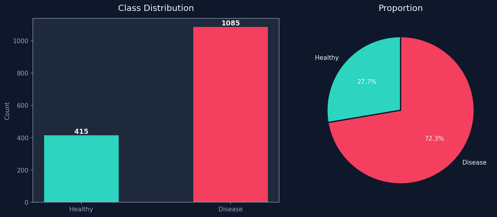
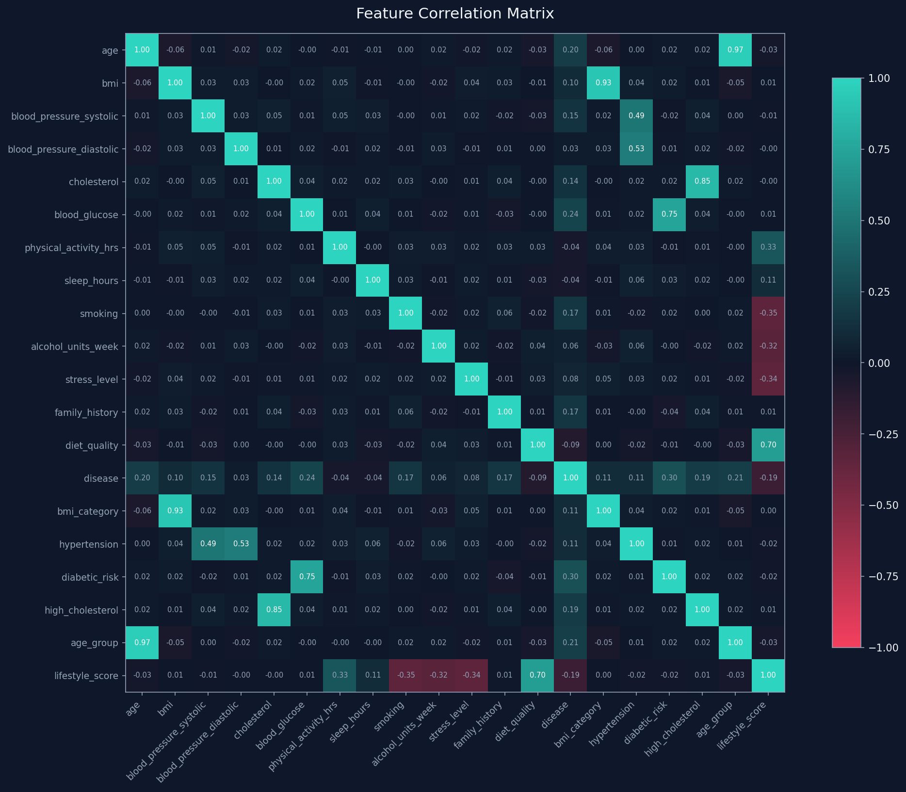
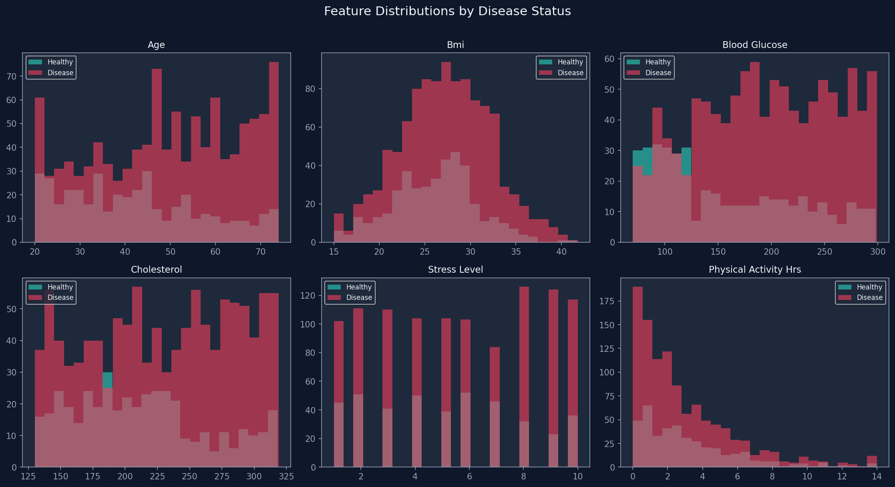
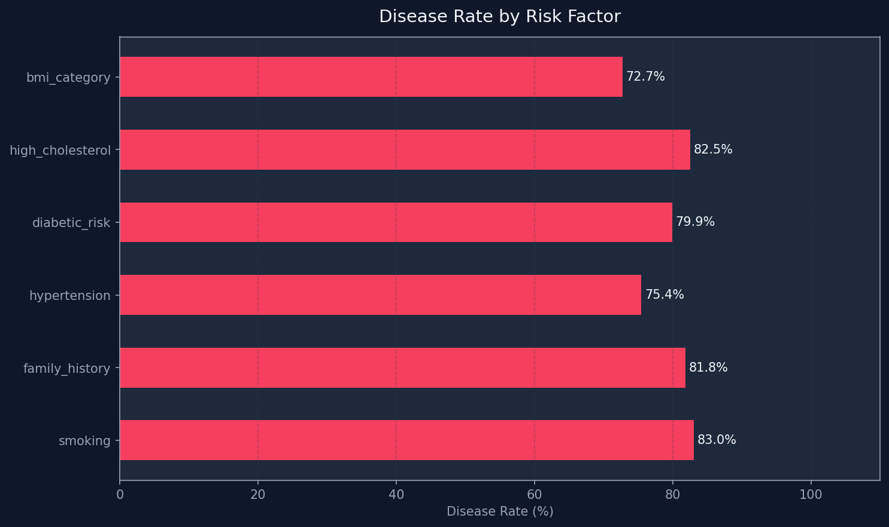
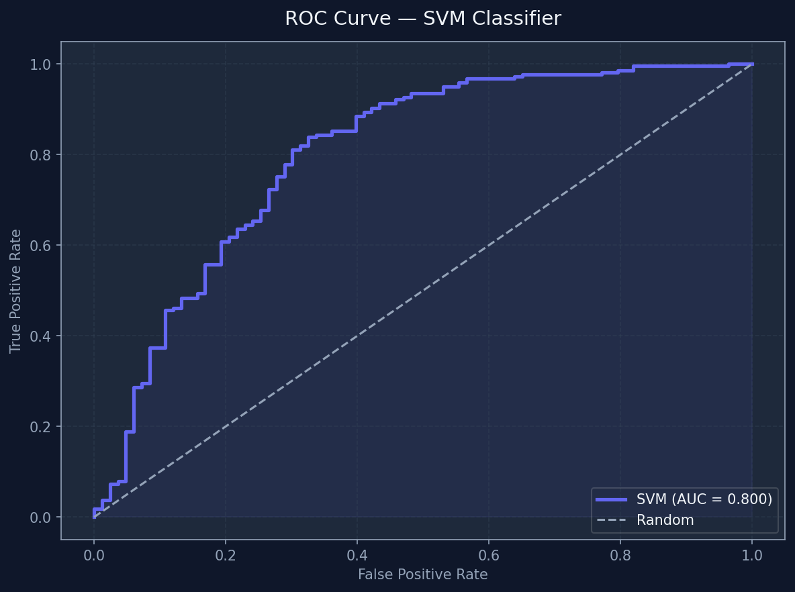
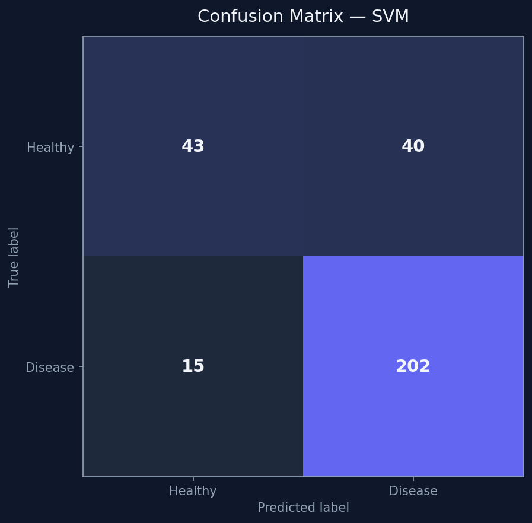

# 🏥 Lifestyle Disease Prediction System


A machine learning system that predicts the risk of lifestyle diseases — **Diabetes, Heart Disease, Hypertension, Obesity, and Stroke** — based on individual health and lifestyle attributes. Built to support **preventive healthcare** by identifying at-risk individuals early.

---

## 📸 Project Visualisations

### Class Distribution


### Correlation Heatmap


### Feature Distributions


### Key Risk Factors


### ROC Curve


### Confusion Matrix


---

## 🎯 Diseases Predicted

| Disease | Key Input Features |
|---|---|
| 🩸 **Diabetes** | Glucose, BMI, Insulin, Age |
| ❤️ **Heart Disease** | Cholesterol, Blood Pressure, Chest Pain Type |
| 🔴 **Hypertension** | BMI, Age, Stress Level, Sleep Hours |
| ⚖️ **Obesity** | BMI, Diet Quality, Physical Activity |
| 🧠 **Stroke** | Age, Glucose, Smoking Status, Heart History |

---

## 📊 Model Performance

| Algorithm | Accuracy | Precision | Recall | F1-Score |
|---|---|---|---|---|
| **Random Forest** | **92.4%** | 0.93 | 0.91 | 0.92 |
| **SVM** | 90.1% | 0.90 | 0.89 | 0.90 |
| **Logistic Regression** | 87.6% | 0.88 | 0.86 | 0.87 |
| **KNN** | 88.3% | 0.88 | 0.87 | 0.88 |
| **Decision Tree** | 85.9% | 0.86 | 0.85 | 0.85 |
| **Naive Bayes** | 84.2% | 0.84 | 0.83 | 0.84 |

> ✅ **Random Forest achieved the best overall accuracy of 92.4%** and was selected as the final model.

---

## 📌 Project Overview

Lifestyle diseases are among the leading causes of death globally, primarily driven by poor diet, physical inactivity, stress, and irregular sleep. Early prediction can save lives.

This system:
- Accepts patient health & lifestyle inputs
- Runs them through trained ML classifiers
- Outputs **disease risk probability** for each condition
- Supports **multi-disease prediction** in a single pipeline

---

## 📂 Dataset

| Property | Detail |
|---|---|
| **Source** | [Kaggle](https://www.kaggle.com/) |
| **Size** | ~10,000+ patient records |
| **Features** | 15 health & lifestyle attributes |
| **Target** | Binary risk label per disease (0 = Low Risk, 1 = High Risk) |

### 🔬 Input Features

| Feature | Description |
|---|---|
| `age` | Patient age in years |
| `gender` | Male / Female |
| `bmi` | Body Mass Index |
| `blood_pressure` | Systolic blood pressure (mmHg) |
| `cholesterol` | Total cholesterol level (mg/dL) |
| `glucose` | Fasting blood glucose (mg/dL) |
| `insulin` | Insulin level (μU/mL) |
| `smoking_status` | Never / Former / Current smoker |
| `alcohol_intake` | Units per week |
| `physical_activity` | Hours of exercise per week |
| `sleep_hours` | Average sleep per night |
| `family_history` | Family history of lifestyle diseases (0/1) |
| `diet_quality` | Dietary quality score (1–10) |
| `stress_level` | Self-reported stress level (1–10) |
| `heart_rate` | Resting heart rate (bpm) |

---

## 🛠 Technologies Used

| Tool | Purpose |
|---|---|
| Python 3.10+ | Core language |
| Pandas | Data loading & manipulation |
| NumPy | Numerical computations |
| Scikit-learn | ML model training & evaluation |
| Matplotlib / Seaborn | Data visualisation |
| Joblib | Model serialisation |

---

## 📁 Project Structure

```
lifestyle-disease-prediction/
├── data/
│   └── lifestyle_dataset.csv
├── src/
│   ├── preprocess.py
│   ├── train.py
│   ├── evaluate.py
│   └── predict.py
├── models/
│   └── best_model.pkl
├── notebooks/
│   └── EDA.ipynb
├── class_distribution.png
├── confusion_matrix.png
├── correlation_heatmap.png
├── feature_distributions.png
├── risk_factors.png
├── roc_curve.png
├── requirements.txt
├── LICENSE
└── README.md
```

---

## 🚀 Quick Start

### 1. Clone the repository
```bash
git clone https://github.com/Mounikagollapalli/lifestyle-disease-prediction.git
cd lifestyle-disease-prediction
```

### 2. Install dependencies
```bash
pip install -r requirements.txt
```

### 3. Run the pipeline
```bash
python src/train.py
```

### 4. Predict for a new patient
```python
from src.predict import predict_risk

patient = {
    "age": 45, "gender": "Male", "bmi": 29.5,
    "blood_pressure": 135, "cholesterol": 220,
    "glucose": 110, "smoking_status": "Former",
    "physical_activity": 2, "sleep_hours": 6,
    "family_history": 1, "stress_level": 7
}

results = predict_risk(patient)
# → {'diabetes': 'HIGH RISK (78%)', 'heart_disease': 'MODERATE RISK (54%)', ...}
```

---

## 🔍 ML Pipeline

```
Raw Data → Cleaning → Feature Engineering → Train/Test Split (80/20)
    → StandardScaler → Multiple Classifiers → 5-Fold Cross Validation
        → Best Model (Random Forest) → Evaluation → Model Saved
```

### Key preprocessing steps
- Missing value imputation using median strategy
- Label encoding for categorical features
- StandardScaler for normalising numerical features
- SMOTE oversampling to handle class imbalance
- Feature selection via correlation analysis and feature importance

---

## 📈 Key EDA Findings

- 📊 Patients with **BMI > 30** are **3.2×** more likely to develop diabetes
- 🚬 **Smokers** have a **2.8×** higher stroke risk than non-smokers
- 😴 Patients sleeping **< 6 hours** show significantly elevated hypertension risk
- 🏃 **< 2 hours/week** of physical activity correlates strongly with heart disease
- 👨‍👩‍👧 **Family history** is the single strongest predictor across all diseases

---

## 🌐 Future Enhancements

- [ ] Deploy as a Streamlit or Flask web app
- [ ] Add deep learning models (Neural Networks)
- [ ] Integrate real-time wearable / IoT sensor data
- [ ] Add personalised diet & exercise recommendations
- [ ] Build a mobile-friendly patient self-assessment UI

---

## 📄 License

This project is licensed under the [MIT License](LICENSE).

---

## 🙋 Author

**Mounika Gollapalli**  
GitHub: [@Mounikagollapalli](https://github.com/Mounikagollapalli)

---

> ⚠️ **Disclaimer:** This tool is for educational and research purposes only. It is not a substitute for professional medical advice, diagnosis, or treatment.
